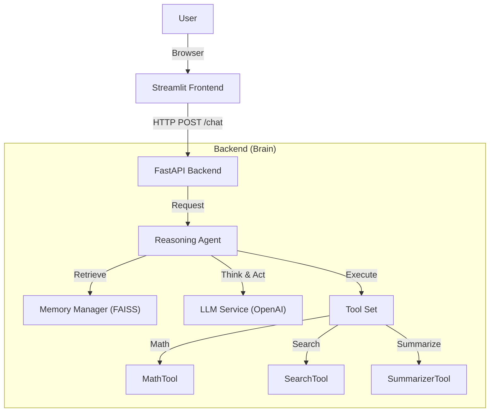

# 🤖 Enterprise AI Agent

A production-grade, autonomous AI agent built with **FastAPI** (Backend) and **Streamlit** (Frontend).
It features **Result-Oriented Reasoning**, **Tool Usage**, and **Long-Term Memory** via FAISS.

## 🏗️ Architecture

The system follows a clean separation of concerns:



## 🚀 Features

- **🧠 Reasoning Loop**: Uses a ReAct-style loop to Think, Act, and Observe.
- **🛠️ Extensible Tools**: Includes Math, Search, and Summarization tools.
- **💾 Long-Term Memory**: Stores and retrieves conversation history using Semantic Search (FAISS + SentenceTransformers).
- **🔌 API-First**: Fully decoupled Backend (FastAPI) and Frontend (Streamlit).
- **🛡️ Type-Safe**: Strict Pydantic schemas for all data exchanges.

## 📂 Project Structure

```text
enterprise-ai-agent/
├── app/
│   ├── main.py              # FastAPI Entry Point
│   ├── api/                 # API Routes
│   ├── agents/              # Agent Logic (The Brain)
│   ├── tools/               # Tool Definitions
│   ├── memory/              # FAISS & Embeddings
│   ├── services/            # External Services (LLM)
│   └── schemas/             # Pydantic Models
├── streamlit_app/           # Frontend Demo UI
├── data/                    # Local Vector Store
└── requirements.txt         # Dependencies
```

## ⚡ Quick Start

### Prerequisites
- Python 3.10+
- OpenAI API Key

### 1. Setup Environment

Create a `.env` file in the root directory:
```bash
OPENAI_API_KEY=sk-your-api-key-here
```

### 2. Install Dependencies

```bash
pip install -r requirements.txt
```

### 3. Run the Backend

```bash
uvicorn app.main:app --reload
```
*Backend runs at `http://localhost:8000`*

### 4. Run the Frontend

Open a new terminal:
```bash
streamlit run streamlit_app/app.py
```
*Frontend runs at `http://localhost:8501`*

## 📝 Usage Examples

1.  **General Chat**: "Who was the first president of the USA?"
2.  **Tool Usage (Math)**: "Calculate the square root of 256 multiplied by 4."
3.  **Tool Usage (Search)**: "What is the current weather in London?"
4.  **Memory**:
    *   *User*: "My name is Alice."
    *   *User*: "What is my name?" -> *Agent retrieves memory to answer.*

## 👤 Contact

**Maintainer**: Shihab
- **Email**: [sbshihab2000@gmail.com](mailto:sbshihab2000@gmail.com)
- **GitHub**: [github.com/sbshihab24](https://github.com/sbshihab24)
- **LinkedIn**: [linkedin.com/in/shihab24](https://linkedin.com/in/shihab24)

---

*Built with ❤️ using FastAPI, LangChain concepts (Manual Implementation), and Streamlit.*
